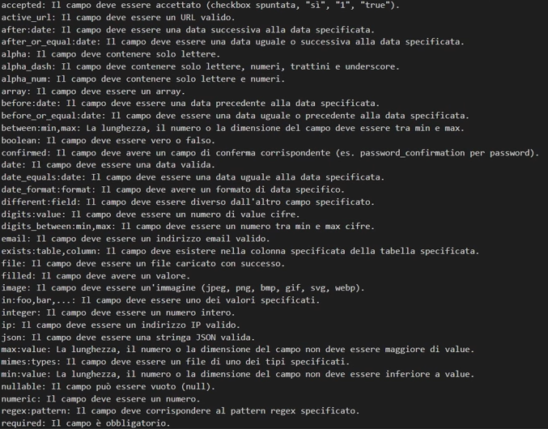
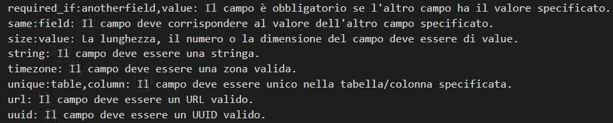
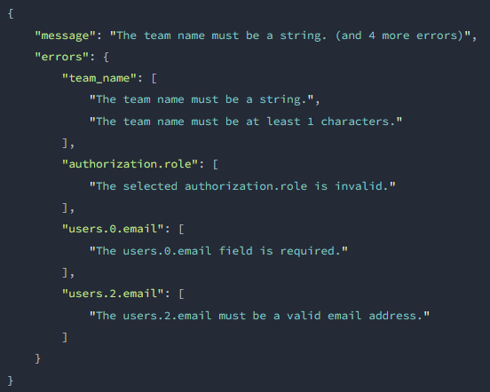
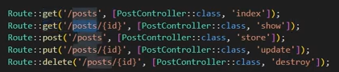
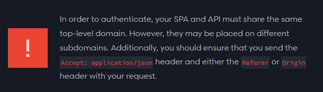

## [thksTo](https://www.youtube.com/watch?v=LmMJB3STuU4&list=PL38wFHH4qYZUXLba1gx1l5r_qqMoVZmKM&ab_channel=LearnwithJon)
## [thksTo2](https://www.youtube.com/watch?v=7pCDK321ckE&list=PL38wFHH4qYZUXLba1gx1l5r_qqMoVZmKM&index=3&ab_channel=LearnwithJon)
## [Hash facade](https://laravel.com/docs/11.x/hashing#introduction)
## [Hash::check](https://laravel.com/docs/11.x/hashing#verifying-that-a-password-matches-a-hash)

## [HTTP Requests](https://laravel.com/docs/11.x/requests)
## [HTTP Responses](https://laravel.com/docs/11.x/responses)

## [Validation](https://laravel.com/docs/11.x/validation#quick-writing-the-validation-logic)
## [Validation Rules](https://laravel.com/docs/11.x/validation#quick-writing-the-validation-logic)

## [XHR Requests and Validation](https://laravel.com/docs/11.x/validation#quick-xhr-requests-and-validation)
## [Validation Error Response Format](https://laravel.com/docs/11.x/validation#validation-error-response-format)

## [Migrations columns type](https://laravel.com/docs/11.x/migrations#available-column-types)
## [Migrations columns modifiers](https://laravel.com/docs/11.x/migrations#column-modifiers)
## [Foreign key constraints](https://laravel.com/docs/11.x/migrations#foreign-key-constraints)
